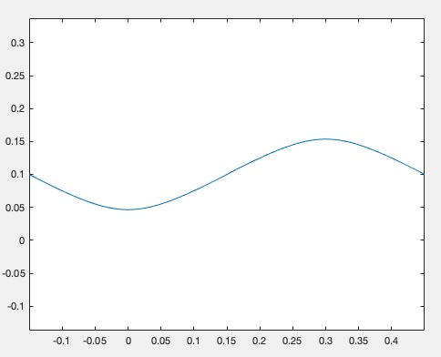

# Homework 11

The requirement is to simulate a trajectory of the hip position of a walking robot in a 3D plane. There are many ways to simulate it, as it is prove it is a hyperbola, so it is actually reasonable to use the hyperbola function and the position, velocity condition to solve the hyperbola function. But I will take another way, which uses ```x``` and ```y``` as a function of ```t```, respectively. The functions are in the lecture PPT and I will not give a LaTeX here. I will append my hand writing derivation at the end of the report.

**The precudure of the code is as follows**
> set parameters like Zc, Sx, Sy, Tsup
> calculate Xbar, Ybar, Vx, Vy
> get the x,y relation of time of first step and second step respectively
> cat the two traj and plot it

The corresponding MATLAB code is:
```matlab
%% 
clear;clc;

%% Define parameters
g = 9.8;
des = 200;
Zc = 0.8;
Tsup = 0.8;
Sx = 0.3;
Sy = 0.2;

Tc = sqrt(Zc/g);
Xbar = 0.5*Sx;
Ybar = 0.5*Sy;
Vx = (Xbar*(1+cosh(Tsup/Tc)))/(Tc*sinh(Tsup/Tc));
Vy = (Ybar*(cosh(Tsup/Tc)-1))/(Tc*sinh(Tsup/Tc));

t = linspace(0,Tsup,des);
x = [0];
y = [0];

%% first step
x_step = -Xbar*cosh(t/Tc)+Vx*Tc*sinh(t/Tc);
y_step = Ybar*cosh(t/Tc)-Vy*Tc*sinh(t/Tc);
x = [x,x_step];
y = [y,y_step];

%% second step
x_step = -Xbar*cosh(t/Tc)+Vx*Tc*sinh(t/Tc)+Sx;
y_step = -Ybar*cosh(t/Tc)+Vy*Tc*sinh(t/Tc)+Sy;
x = [x,x_step];
y = [y,y_step];

%% plot
x = x(2:length(x));
y = y(2:length(y));
plot(x,y);
axis equal;
```

And the plotted fig is as follows:


The following the hand writing sketch: