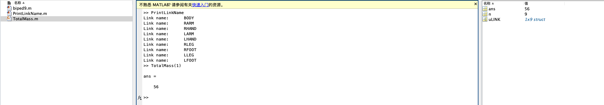

# ZHAO Yuntian 11811715 HW5

## script ```biped9.m```

```matlab
%% clear
clear;
clc;

%% define robot
global uLINK

uLINK = struct('name', 'BODY', 'sister', 0, 'child', 2, 'm', 20);
uLINK(2) = struct('name', 'RARM', 'sister', 4, 'child', 3, 'm', 5);
uLINK(3) = struct('name', 'RHAND', 'sister', 0, 'child', 0, 'm', 1);
uLINK(4) = struct('name', 'LARM', 'sister', 6, 'child', 5, 'm', 5);
uLINK(5) = struct('name', 'LHAND', 'sister', 0, 'child', 0, 'm', 1);
uLINK(6) = struct('name', 'RLEG', 'sister', 8, 'child', 7, 'm', 10);
uLINK(7) = struct('name', 'RFOOT', 'sister', 0, 'child', 0, 'm', 2);
uLINK(8) = struct('name', 'LLEG', 'sister', 0, 'child', 9, 'm', 10);
uLINK(9) = struct('name', 'LFOOT', 'sister', 0, 'child', 0, 'm', 2);
```

## script ```PrintLinkName.m```

```matlab
global uLINK;

% print all name of the Robot
for n=1:length(uLINK)
    fprintf('Link name:\t%s\n', uLINK(n).name);
end
```

## script ```TotalMass.m```

```matlab
function output = TotalMass(input)
% TotalMass - Description
% output is total mass
% input is the root of the tree
% recursively calculate mass of robot
global uLINK
if input == 0
    output = 0;
else
    output = uLINK(input).m + TotalMass(uLINK(input).sister) + TotalMass(uLINK(input).child);
end
```

## Execute and Result

After navigate to the script directory, using the command line to execute the scripts.

```
>>> biped9
>>> PrintLinkName
>>> TotalMass(1)
```

The execute result is as follows:
