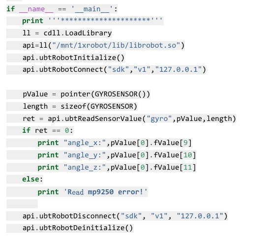

# Report for lab 3

**ZHAO Yuntian** **11811715**

[TOC]

## 3.2 Robot Programming and Control

### Sensor reading

#### Read the 9-axis IMU and timely printing out

The code for the task is just using the API to read the IMU data, then print it out. This will be enbedded in a while loop with sleep to perform periodically.

```py
import RestfulAPI
import time
ip_addr = "127.0.0.1"

while True:
    res = RestfulAPI.get_sensors_gyro()
    print("euler_x = %.3f " %(res["data"]["gyro"][0]["euler-x"]))
    print("euler_y = %.3f " %(res["data"]["gyro"][0]["euler-y"]))
    print("euler_z = %.3f " %(res["data"]["gyro"][0]["euler-z"]))
    print("gyro_x = %.3f " %(res["data"]["gyro"][0]["gyro-x"]))
    print("gyro_y = %.3f " %(res["data"]["gyro"][0]["gyro-y"]))
    print("gyro_z = %.3f " %(res["data"]["gyro"][0]["gyro-z"]))
    print("accel_x = %.3f " %(res["data"]["gyro"][0]["accel-x"]))
    print("accel_y = %.3f " %(res["data"]["gyro"][0]["accel-y"]))
    print("accel_z = %.3f " %(res["data"]["gyro"][0]["accel-z"]))
    print("compass_x = %.3f " %(res["data"]["gyro"][0]["compass-x"]))
    print("compass_y = %.3f " %(res["data"]["gyro"][0]["compass-y"]))
    print("compass_z = %.3f " %(res["data"]["gyro"][0]["compass-z"]))
    print("---------------------------------------------------------")
    time.sleep(0.5)

```

And the output is 

```
euler_x = 87.003 
euler_y = 0.200 
euler_z = 7.949 
gyro_x = -2.014 
gyro_y = 0.916 
gyro_z = -0.366 
accel_x = 0.002 
accel_y = 0.983 
accel_z = 0.056 
compass_x = 72.450 
compass_y = -132.000 
compass_z = 27.900 
---------------------------------------------------------
euler_x = 86.999 
euler_y = 0.219 
euler_z = 7.949 
gyro_x = -1.526 
gyro_y = 0.061 
gyro_z = -0.061 
accel_x = -0.006 
accel_y = 0.987 
accel_z = 0.049 
compass_x = 74.850 
compass_y = -134.100 
compass_z = 29.850 
---------------------------------------------------------
```
There is also a corresponding video of the IMU reading and printing.

#### Querying and setting different joint angles

The code for this task is as follows, it first reads the angle of a given joint, then set it to another given angle.

```py
import RestfulAPI
from pprint import pprint

print "you should edit the file to change joint name and joint angle"
res = RestfulAPI.get_servos_angles(["RightElbowFlex"])
print("joint angle is %s " %(res["data"]["RightElbowFlex"]))
angle = 90 
RestfulAPI.put_servos_angles({"RightElbowFlex":angle}, runtime=1000)
```

It is wiered that the input is not working properly, as the RESTful api seems not working with python strings. Another noticeable point is that seems Yan Shee is working with python 2.7.

There is also a corresponding video.

### Single leg motion control

the code is as follows, which makes the three joints of right leg in a motion as the commeted angle:

```py
import RestfulAPI
import time
import numpy as np
ip_addr = "127.0.0.1"
# RightHipLR: 50 - 90 degree
# RightHipFB: 30 - 70 degree
# RightKneeFlex: 40 - 80 degree

f = 1
t = 0
while t < 10:
    q_d_haa_r = 20 * np.sin(2 * np.pi * f * t) + 70
    q_d_hfe_r = 20 * np.sin(2 * np.pi * f * t) + 50
    q_d_kfe_r = 20 * np.sin(2 * np.pi * f * t) + 60
    RestfulAPI.put_servos_angles({"RightHipLR": int(q_d_haa_r),
                                  "RightHipFB": int(q_d_hfe_r),
                                  "RightKneeFlex": int(q_d_kfe_r)},
                                  runtime=1000)

    t = t + 0.1

RestfulAPI.put_motions("start")
time.sleep(1)
```

There is a corresponding video, as well.

## Analyse of stand up after fall

In some version of the Yan Shee API, there is two function:
```py
standup_in_front()
standup_at_back()
```
Which is a direct call to a shared object.


[reference link of above code](https://wenku.baidu.com/view/124f406785c24028915f804d2b160b4e777f8179.html)

I failed to find the share object library and there is no similar api in RESTful api of Yan Shee, so the task is not performed. Some have talked about record the motion of Yan's standing up when power is on, but I think it is not very fesible.
